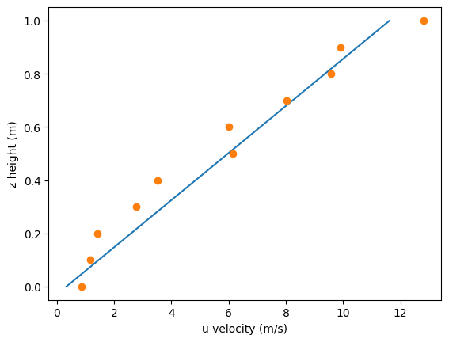

# HW1: Linear Regression

## 📌 作業說明
本作業透過 Python 模擬透過實驗量測之 Couette flow 數據，以線性回歸方式，將給定之距離 z 預測對應之速度 u。

"Couette flow" 為流體力學中的經典流場，其形成原因為平板移動造成的剪切應力驅動流體，其解析解可透過求解連續方程式與 Navier-Stokes 方程式求得。

$$
u =z \frac{U}{H}
$$

其中 U 為平板移動速度、H 為平板距離底面高度、z 為測量點與底面之垂直距離。

## 🖼️ 回歸結果

