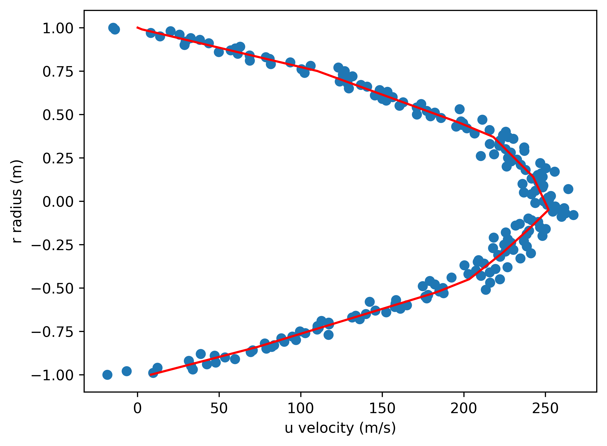

# HW2: Nonlinear Regression

## 📌 作業說明
本作業透過 Python 模擬實驗量測之 Hagen–Poiseuille flow 數據，以非線性回歸方式，預測對應之流體速度 u。

"Hagen–Poiseuille flow" 為流體力學中的經典流場，形成原因為圓管中的壓力梯度驅動流體，其解析解可透過求解連續方程式與 Navier-Stokes 方程式求得。

$$
u = \frac{G}{4\mu}(R^2 - r^2)
$$

其中 G 為壓力梯度、μ 為流體動力黏滯係數、R 為管半徑、r 為量測點與圓管中心之距離。

## 🖼️ 回歸結果

