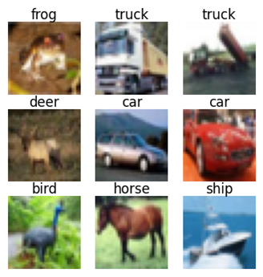

# HW3: Image Recognition with CIFAR-10

## 📌 作業說明
本作業使用 **CIFAR-10** 資料集進行影像分類。CIFAR-10 含有 10 個類別的彩色圖片（飛機、汽車、鳥、貓、鹿、狗、青蛙、馬、船、卡車），每個類別有 6,000 張圖片，共 60,000 張 32×32 的彩色圖片。請根據 sample code，建立全連接層之神經網路以訓練可辨識 CIFAR-10 測試集的模型。其中:
- 訓練集：50,000 張
- 測試集：10,000 張

## CIFAR-10 資料集範例

