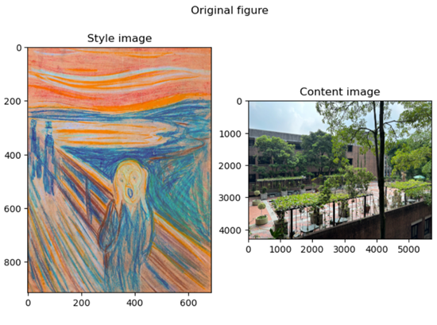
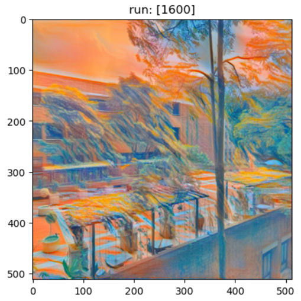

# HW4: Neural Style Transfer

## 📌 作業說明
本作業以「風格遷移」為題，透過捲積神經網路各層的特徵最佳化，將 **內容圖片** 的語意與 **風格圖片** 的筆觸、紋理融合，生成新影像。

## 🖼️ 風格遷移範例

### 原圖
Style image and content image used for neural style transfer.

### 轉移結果
Result after running neural style transfer for 1600 iterations.

